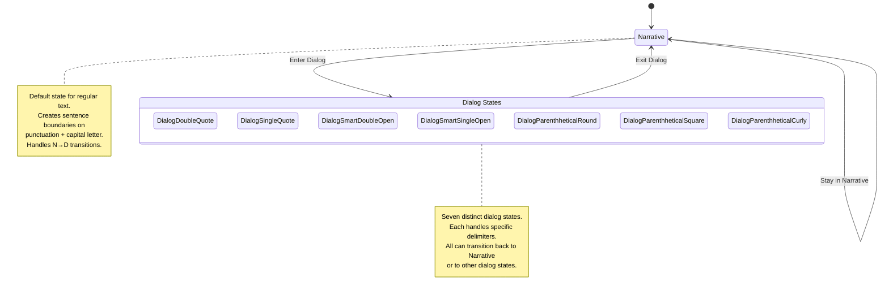
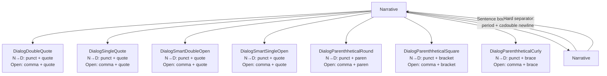
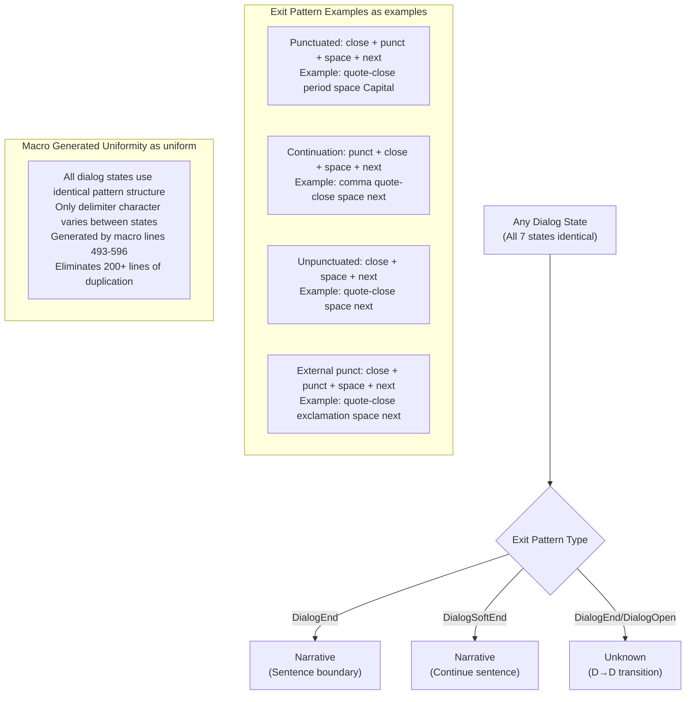
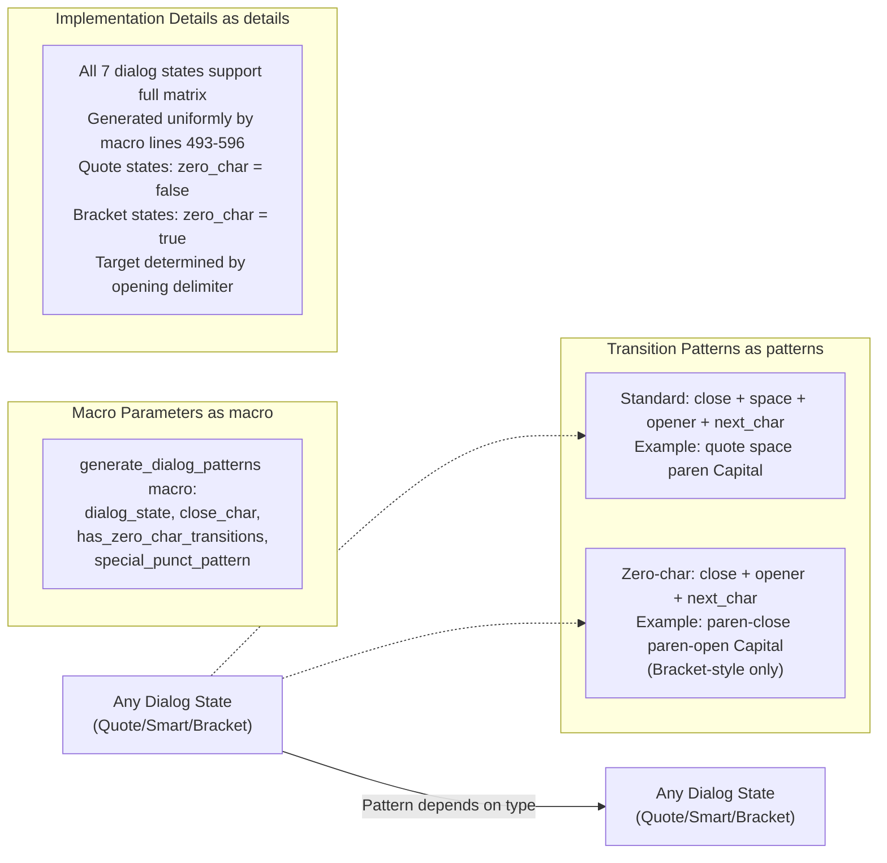

# Dialog State Machine

This diagram represents the state machine implemented in `src/sentence_detector/dialog_detector.rs` for dialog-aware sentence detection.

## Overview Diagram

## Detailed State Transitions

### From Narrative State

### Dialog State Exits

### Dialog-to-Dialog Transitions

## State Descriptions

- **Narrative**: Default state for regular text outside of dialog
- **DialogDoubleQuote**: ASCII double quote dialog (`"`)
- **DialogSingleQuote**: ASCII single quote dialog (`'`) 
- **DialogSmartDoubleOpen**: Smart double quote dialog (`"`)
- **DialogSmartSingleOpen**: Smart single quote dialog (`'`)
- **DialogParenthheticalRound**: Parenthetical dialog (`()`)
- **DialogParenthheticalSquare**: Square bracket dialog (`[]`)
- **DialogParenthheticalCurly**: Curly brace dialog (`{}`)

## Transition Types

- **N→D transition**: Creates sentence boundary AND enters dialog state
- **Dialog open**: Enters dialog state without sentence boundary  
- **Dialog end**: Creates sentence boundary and returns to Narrative
- **Dialog soft end**: Returns to Narrative without sentence boundary
- **Continuation punct**: Handles punctuation that continues sentences
- **Hard separator**: Double newline separators that force sentence boundaries